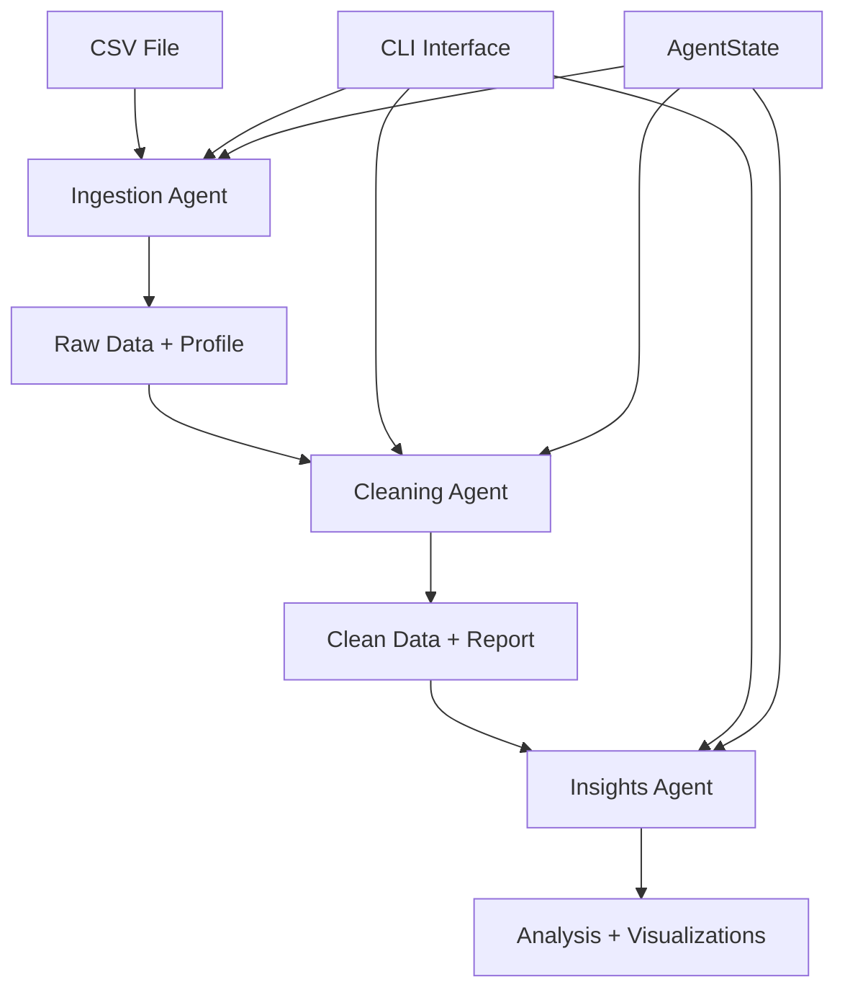

# Agentic AI Data Analytics Pipeline CLI

A powerful command-line tool for automated data analytics that orchestrates a complete pipeline for CSV data processing, cleaning, and insights generation.

## 🚀 Features

- **Automated Pipeline**: Complete end-to-end data processing workflow
- **Data Ingestion**: Smart CSV file reading with automatic profiling
- **Data Cleaning**: Intelligent data cleaning with issue detection and resolution
- **Insights Generation**: Advanced statistical analysis and visualization
- **CLI Interface**: User-friendly command-line interface with progress bars
- **Flexible Execution**: Skip steps, customize outputs, and control verbosity
- **Rich Output**: Colored terminal output with emojis for better UX

## 📺 Demo
[](https://youtu.be/AeIIdRpMH8E)

### [Demo Video](https://youtu.be/AeIIdRpMH8E)

## 📋 Pipeline Steps

### 1. 📥 Data Ingestion

- Reads and validates CSV files
- Generates data profiling reports
- Creates initial data snapshots
- Outputs: `raw_data.csv`, `profile.html`

### 2. 🧹 Data Cleaning

- Detects and resolves data quality issues
- Handles missing values, duplicates, and outliers
- Generates cleaning reports with detailed statistics
- Outputs: `cleaned_data.csv`, `cleaning_report.md`

### 3. 💡 Insights & Analysis

- Performs statistical analysis
- Generates key insights and recommendations
- Creates visualizations and charts
- Outputs: `statistical_analysis.json`, `policy_insights_report.md`, `visualizations/*`

## 🛠️ Installation

### Prerequisites

- Python 3.7+
- Required Python packages (install via pip):

```bash
pip install click pandas numpy matplotlib seaborn plotly
```

### Install the CLI Tool

1. Clone or download the repository
2. Install dependencies:

```bash
pip install -r requirements.txt
```

3. Make the script executable (optional):

```bash
chmod +x orchestrator.py
```

## 📖 Usage

### Basic Syntax

```bash
python orchestrator.py [OPTIONS] CSV_FILE
```

### Required Arguments

- `CSV_FILE`: Path to the input CSV file to process

### Optional Arguments

- `--output-dir`, `-o`: Output directory for generated files (default: `./output/`)
- `--verbose`, `-v`: Enable verbose logging and detailed output
- `--skip-ingestion`: Skip the data ingestion step
- `--skip-cleaning`: Skip the data cleaning step
- `--skip-insights`: Skip the insights generation step
- `--help`: Show help message and exit

## 💡 Examples

### Basic Usage

Process a CSV file with default settings:

```bash
python orchestrator.py data/sales_data.csv
```

### Custom Output Directory

Specify where to save results:

```bash
python orchestrator.py data/sales_data.csv -o ./analysis_results/
```

### Verbose Mode

Get detailed progress information:

```bash
python orchestrator.py data/sales_data.csv -v
```

### Skip Specific Steps

Skip cleaning if data is already clean:

```bash
python orchestrator.py data/sales_data.csv --skip-cleaning
```

Process only ingestion and cleaning:

```bash
python orchestrator.py data/sales_data.csv --skip-insights
```

### Advanced Usage

Full customization:

```bash
python orchestrator.py data/customer_data.csv \
  --output-dir ./customer_analysis/ \
  --verbose \
  --skip-ingestion
```

### Alternative CLI Interface

The tool also supports a grouped CLI interface:

```bash
# Process command
python orchestrator.py process data/sales_data.csv -v -o results/

# Check version
python orchestrator.py version
```

## 📁 Output Structure

After running the pipeline, you'll find the following files in your output directory:

```
output/
├── raw_data.csv                    # Original ingested data
├── profile.html                    # Data profiling report
├── cleaned_data.csv               # Cleaned dataset
├── cleaning_report.md             # Data cleaning summary
├── statistical_analysis.json      # Statistical analysis results
├── policy_insights_report.md      # Generated insights report
└── visualizations/                # Generated charts and plots
    ├── distribution_plots.png
    ├── correlation_heatmap.png
    └── trend_analysis.png
```

## 🔧 Configuration

### Environment Variables

Create a `.env` file in your project directory to configure:

```env
# Example environment variables
DEFAULT_OUTPUT_DIR=./outputs/
ENABLE_GPU_PROCESSING=false
LOG_LEVEL=INFO
API_KEY=<llm api key>
BASE_URL=<base url for your llm provider>
MODEL=<ai model name>
```

In the video demonstration I've used qwen-3-235b-a22b-instruct-2507 from cerebras, because it was free of cost and offered generous amount of requests.

### Agent Configuration

The pipeline uses three specialized agents:

- **Ingestion Agent**: Handles data reading and initial validation
- **Cleaning Agent**: Performs data quality improvements
- **Insights Agent**: Generates analysis and visualizations

## 📊 Sample Output

### Console Output

```bash
🚀 Starting data analytics pipeline...
📁 Input file: data/iris.csv
📂 Output directory: ./output/

==================================================
📥 STEP 1: DATA INGESTION
==================================================
Processing ingestion  [####################################]  100%
✅ Ingestion completed successfully!
📊 Data shape: 150 rows × 5 columns

==================================================
🧹 STEP 2: DATA CLEANING
==================================================
Processing cleaning  [####################################]  100%
✅ Cleaning completed successfully!
🔍 Issues detected: 3
⚡ Actions performed: 2

==================================================
💡 STEP 3: INSIGHTS & ANALYSIS
==================================================
Generating insights  [####################################]  100%
✅ Insights & Analysis completed successfully!

🎯 Key Insights Generated:
1. Species Distribution: The dataset contains three balanced species classes
2. Feature Correlations: Strong correlation found between petal dimensions
3. Outlier Detection: 2 potential outliers identified in sepal width

📈 Visualizations Generated:
• ./output/visualizations/species_distribution.png
• ./output/visualizations/correlation_matrix.png

==================================================
🎉 PIPELINE COMPLETED SUCCESSFULLY!
==================================================
📂 Output location: ./output/
```

## 🐛 Troubleshooting

### Common Issues

**1. "Module not found" errors**

```bash
# Install missing dependencies
pip install -r requirements.txt
```

**2. "File not found" errors**

```bash
# Check file path and permissions
ls -la path/to/your/file.csv
```

**3. "Not a CSV file" errors**

```bash
# Ensure file has .csv extension
mv data.txt data.csv
```

**4. Memory issues with large files**

```bash
# Use chunking for large datasets (modify code or contact support)
```

### Debug Mode

Enable verbose logging for troubleshooting:

```bash
python orchestrator.py data.csv -v
```

## 📋 Requirements

### Core Dependencies

```
click>=8.0.0
pandas>=1.3.0
numpy>=1.21.0
matplotlib>=3.4.0
seaborn>=0.11.0
plotly>=5.0.0
python-dotenv>=0.19.0
```

### Optional Dependencies

```
jupyter>=1.0.0          # For notebook integration
openpyxl>=3.0.0         # For Excel file support
xlrd>=2.0.0             # For legacy Excel support
```

## 📄 License

This project is licensed under the MIT License - see the [LICENSE](LICENSE) file for details.

## 📞 Support

- **Documentation**: Check this README and inline help (`--help`)
- **Issues**: Report bugs via GitHub Issues
- **Email**: <support@yourorganization.com>
- **FAQ**: Check the [Wiki](link-to-wiki) for frequently asked questions

## 🏗️ Architecture



## 🚀 Roadmap

- [ ] Support for Excel and JSON input formats
- [ ] Real-time data streaming capabilities
- [ ] Web dashboard interface
- [ ] Docker containerization
- [ ] Cloud deployment options (AWS, Azure, GCP)
- [ ] Machine learning model integration
- [ ] API endpoints for programmatic access
- [ ] Integration with popular BI tools

## 🎯 Performance

- **Small datasets** (< 1MB): Sub-second processing
- **Medium datasets** (1MB - 100MB): 1-30 seconds
- **Large datasets** (100MB - 1GB): 30 seconds - 5 minutes
- **Very large datasets** (> 1GB): Consider chunking or cloud processing

---
